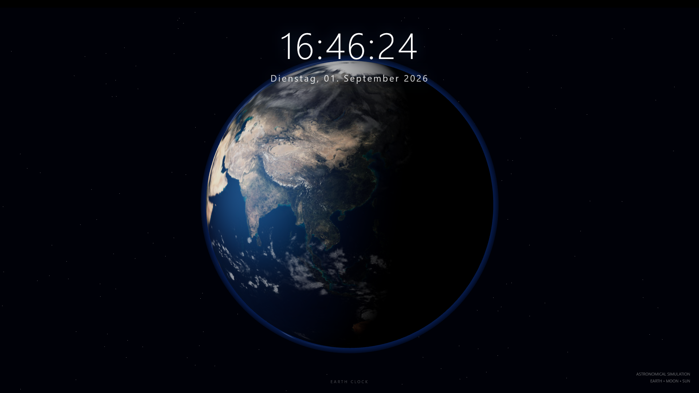

# Earth Clock

Earth Clock is a dynamic 3D visualization of Earth that combines a real-time clock with an animated Earth, clouds, Moon, and dynamic sunlight. 


The project aims to create a realistic and continuously changing view of Earth while combining it with a functional clock.

## Features

* Real-time clock
* Rotating Earth
* Animated cloud layer
* Moving Moon
* Dynamic day and night lighting
* 3D space environment
* Continuous animation
* Browser-based visualization

## About the Project

Earth Clock represents Earth as a continuously animated 3D globe.

The Earth rotates around its own axis while a separate cloud layer moves around the planet. The Moon is also animated and moves relative to Earth.

The lighting changes dynamically to represent the illuminated and dark sides of the planet. This creates a visible day and night cycle on the Earth's surface.

The current time is displayed together with the Earth visualization and updates continuously.

## Technology

The project currently consists of a single HTML file and runs directly in a modern web browser.

Main technologies:

* HTML
* CSS
* JavaScript
* Web-based 3D rendering

## Project Structure

```text
EarthClock/
└── index.html
```

All current project functionality is contained in `index.html`.

## Running the Project

No installation is required.

Simply open `index.html` in a modern web browser.

For the best experience, the project can also be hosted using GitHub Pages or another web server.

## Using Earth Clock with Lively Wallpaper

Earth Clock can be used as an animated desktop wallpaper with **Lively Wallpaper**.

### Requirements

* Windows
* Lively Wallpaper
* A working copy of the Earth Clock project

### Setup

1. Download or clone this repository.
2. Make sure the project contains the `index.html` file.
3. Open **Lively Wallpaper**.
4. Add a new wallpaper using the **Add Wallpaper** option.
5. Select the Earth Clock project's `index.html` file.
6. Lively Wallpaper will load the HTML page as an interactive wallpaper.
7. Select the wallpaper to apply it to your desktop.

Because Earth Clock runs directly in the browser, no additional installation of the project itself is required.

### GitHub Pages

If the project is hosted with GitHub Pages, the published website can also be used as the source for the wallpaper, depending on the Lively Wallpaper version and configuration.

The local `index.html` file is recommended because it does not depend on an internet connection after the project has been downloaded.

## Project Goals

The goal of Earth Clock is to create a realistic and visually appealing Earth simulation that combines astronomical movement with a functional clock.

Future development may include more accurate astronomical calculations, improved textures and atmospheric effects, additional celestial objects, and further interactive features.

## Project Status

Earth Clock is an ongoing project.

The current version contains the core Earth visualization, Earth rotation, cloud animation, Moon movement, dynamic lighting, and real-time clock.

More features and improvements may be added over time.

## License

No specific open-source license has been added to this repository yet.
